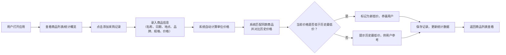

## 1. 产品概述

家庭采购比价工具，帮助用户记录日常购买的商品信息，自动计算单位价格并追踪历史价格走势，让用户在下次购买时能快速参考最低买入价，实现精明消费。

- 核心价值：通过单位价格标准化对比，消除不同规格包装的价格迷惑，直观展示商品的历史最低价和平均价
- 目标用户：家庭主妇/主夫、精打细算的消费者、需要管理家庭开支的用户

## 2. 核心 Features

### 2.1 用户角色

| 角色 | 注册方式 | 核心权限 |
|------|---------|----------|
| 普通用户 | 无需注册，本地存储 | 录入商品、查看历史价格、管理采购记录 |

### 2.2 功能模块

1. **商品录入模块**：录入购买日期、地点、品牌、规格、单价、总价等信息
2. **单位价格计算模块**：自动将不同规格转换为标准单位价格（如元/100ml、元/斤）
3. **价格统计模块**：展示同款商品的历史最低价、平均价、最新价
4. **商品列表模块**：按商品分类展示所有采购记录，支持搜索筛选
5. **价格趋势模块**：展示商品价格变化趋势，帮助判断买入时机

### 2.3 页面详情

| 页面名称 | 模块名称 | 功能描述 |
|---------|---------|----------|
| 首页 | 数据概览卡片 | 展示总商品数、本月采购次数、累计节省金额等统计数据 |
| 首页 | 快捷录入区 | 快速添加新的采购记录表单 |
| 首页 | 商品列表区 | 展示所有商品，支持按名称搜索、按分类筛选 |
| 商品详情页 | 价格统计区 | 展示历史最低价、平均价、最新价、价格走势图 |
| 商品详情页 | 采购历史区 | 展示该商品的所有采购记录列表 |
| 商品详情页 | 比价提示区 | 当录入价格高于历史最低价时，醒目提示用户 |

## 3. 核心流程

## 4. 用户界面设计

### 4.1 设计风格

- **主色调**：温暖的橙黄色系（#FF6B35 主色）搭配清新的薄荷绿（#2EC4B6 辅助色），传递温馨家庭感和精明理财的理念
- **背景**：米白色调（#FFFAF0）搭配柔和的渐变背景，营造舒适的使用体验
- **按钮风格**：圆角设计（12px），带有轻微的悬浮阴影效果，点击时有缩放反馈
- **字体**：标题使用 "Noto Sans SC" 700 粗体，正文使用 "Noto Sans SC" 400 常规字重
- **布局风格**：卡片式布局，信息分组清晰，带有柔和的投影和圆角
- **图标风格**：使用 lucide-react 线性图标，与整体简洁风格统一

### 4.2 页面设计概览

| 页面名称 | 模块名称 | UI 元素 |
|---------|---------|---------|
| 首页 | 数据概览卡片 | 渐变背景卡片、图标+数字展示、悬浮动效、4列网格布局 |
| 首页 | 快捷录入表单 | 分组输入框、自动计算提示、提交按钮、流畅的展开收起动画 |
| 首页 | 商品列表 | 卡片式列表、单位价格醒目标示、最低价标签、悬停高亮效果 |
| 商品详情页 | 价格统计区 | 大号数字展示最低价、价格趋势折线图、三色价格对比卡片 |
| 商品详情页 | 采购历史 | 时间轴式列表、地点标签、价格对比标识 |

### 4.3 响应式设计

- **桌面端优先**：1200px 以上为主要设计尺寸，采用 3-4 列网格布局
- **平板端**：768px-1199px，调整为 2 列网格，简化部分信息展示
- **移动端**：375px-767px，单列布局，优化触控区域，隐藏次要信息
- **触控优化**：按钮最小高度 44px，输入框增加内边距，方便手指点击

### 4.4 动效设计

- **页面加载**：卡片依次淡入，带有轻微的上移动画（staggered reveal）
- **价格提示**：当检测到新低价时，数字有弹跳放大动画，配合彩色光晕
- **表单交互**：输入框聚焦时有边框颜色过渡，提交按钮有 loading 状态
- **列表滚动**：滚动时导航栏背景渐变，回到顶部按钮平滑出现
