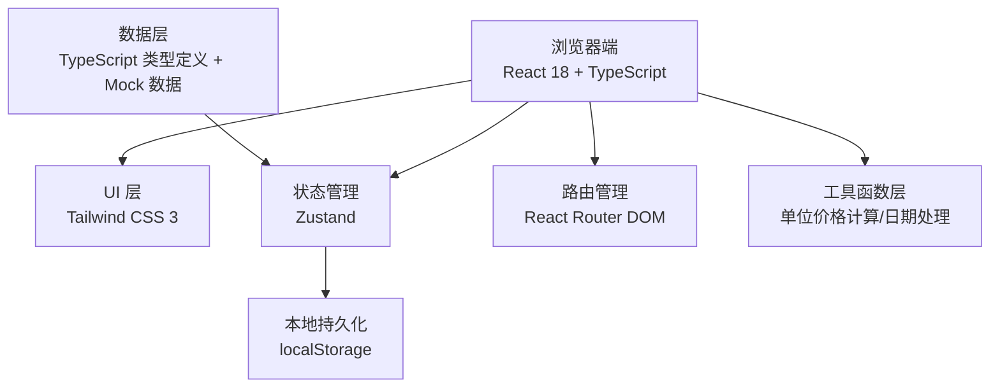
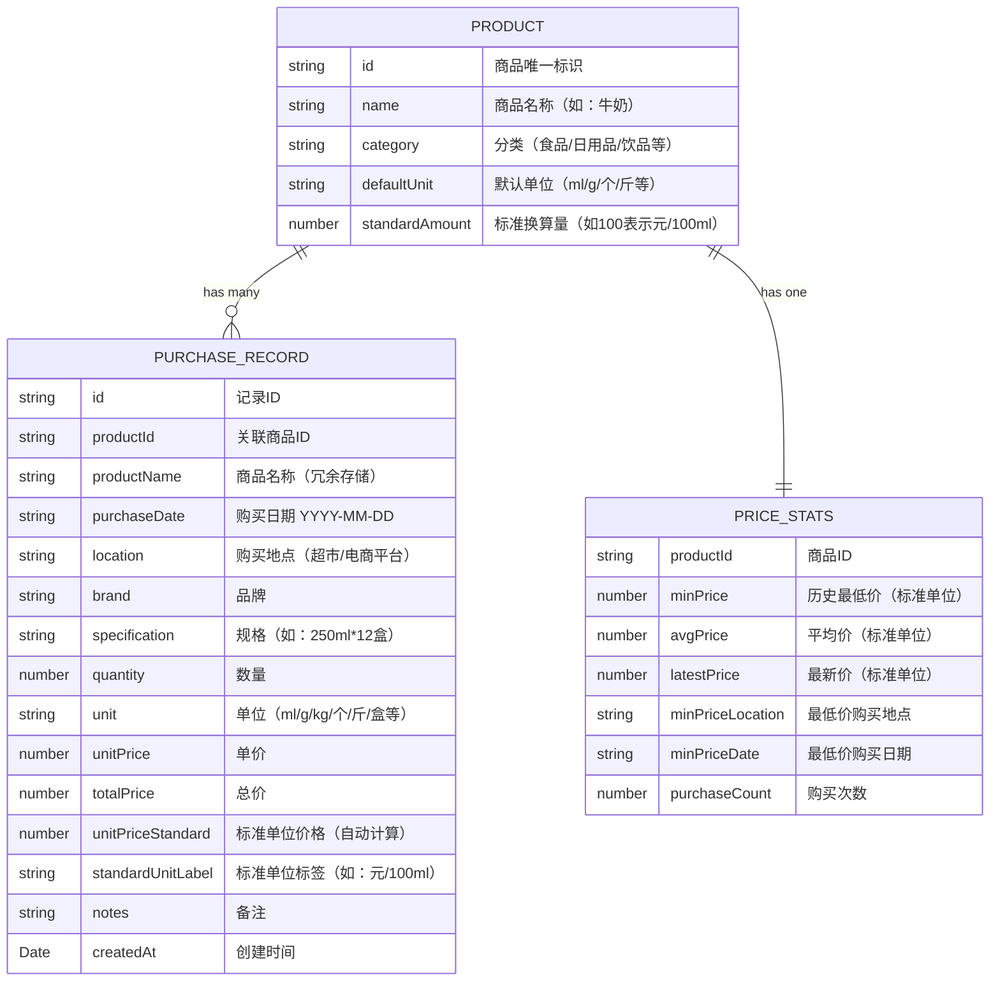

## 1. 架构设计



## 2. 技术描述

- **前端框架**：React@18 + TypeScript@5 + Vite@5
- **初始化工具**：vite-init
- **样式方案**：Tailwind CSS@3
- **状态管理**：Zustand@4（轻量级状态管理，支持中间件持久化）
- **路由管理**：React Router DOM@6
- **图标库**：lucide-react
- **数据可视化**：recharts（轻量级图表库，用于价格趋势图）
- **后端**：无（纯前端应用，数据存储在浏览器 localStorage）
- **数据库**：localStorage 浏览器本地存储

## 3. 路由定义

| 路由路径 | 页面名称 | 页面用途 |
|---------|---------|---------|
| `/` | 首页 | 数据概览、快捷录入、商品列表 |
| `/product/:id` | 商品详情页 | 价格统计、采购历史、价格趋势 |
| `/add` | 新增采购记录页 | 完整的采购记录录入表单 |

## 4. 数据模型

### 4.1 数据模型定义



### 4.2 TypeScript 类型定义

```typescript
// 商品分类
type Category = '食品' | '日用品' | '饮品' | '粮油' | '个护' | '其他';

// 单位类型
type UnitType = 'ml' | 'l' | 'g' | 'kg' | '斤' | '个' | '盒' | '包' | '卷' | '抽' | '其他';

// 商品定义
interface Product {
  id: string;
  name: string;
  category: Category;
  defaultUnit: UnitType;
  standardAmount: number; // 标准单位换算基数，如100表示元/100ml
  createdAt: string;
}

// 采购记录
interface PurchaseRecord {
  id: string;
  productId: string;
  productName: string;
  purchaseDate: string; // YYYY-MM-DD
  location: string;
  brand: string;
  specification: string;
  quantity: number;
  unit: UnitType;
  unitPrice: number;
  totalPrice: number;
  unitPriceStandard: number; // 自动计算的标准单位价格
  standardUnitLabel: string; // 如 "元/100ml"
  notes?: string;
  createdAt: string;
}

// 价格统计
interface PriceStats {
  productId: string;
  productName: string;
  minPrice: number;
  minPriceDate: string;
  minPriceLocation: string;
  avgPrice: number;
  latestPrice: number;
  latestPriceDate: string;
  purchaseCount: number;
  totalSpent: number;
  standardUnitLabel: string;
}

// 表单数据
interface PurchaseFormData {
  productName: string;
  category: Category;
  purchaseDate: string;
  location: string;
  brand: string;
  specification: string;
  quantity: number;
  unit: UnitType;
  unitPrice: number;
  totalPrice: number;
  notes?: string;
}
```

### 4.3 单位换算规则

```typescript
// 单位换算到标准单位的系数
const UNIT_CONVERSIONS: Record<UnitType, { toStandard: number; standardUnit: string }> = {
  'ml': { toStandard: 0.01, standardUnit: '100ml' },      // 1ml = 0.01 * 100ml
  'l': { toStandard: 10, standardUnit: '100ml' },         // 1l = 10 * 100ml
  'g': { toStandard: 0.002, standardUnit: '斤' },         // 1g = 0.002斤 (500g=1斤)
  'kg': { toStandard: 2, standardUnit: '斤' },            // 1kg = 2斤
  '斤': { toStandard: 1, standardUnit: '斤' },
  '个': { toStandard: 1, standardUnit: '个' },
  '盒': { toStandard: 1, standardUnit: '盒' },
  '包': { toStandard: 1, standardUnit: '包' },
  '卷': { toStandard: 1, standardUnit: '卷' },
  '抽': { toStandard: 0.01, standardUnit: '100抽' },      // 1抽 = 0.01 * 100抽
  '其他': { toStandard: 1, standardUnit: '单位' },
};

// 计算标准单位价格
// 公式: 标准单位价格 = 总价 / (数量 * 换算系数)
// 示例: 250ml牛奶，3.5元
// 标准价格 = 3.5 / (250 * 0.01) = 3.5 / 2.5 = 1.4 元/100ml
function calculateStandardPrice(
  totalPrice: number,
  quantity: number,
  unit: UnitType
): { price: number; label: string } {
  const conversion = UNIT_CONVERSIONS[unit];
  const standardQuantity = quantity * conversion.toStandard;
  const standardPrice = totalPrice / standardQuantity;
  return {
    price: Number(standardPrice.toFixed(2)),
    label: `元/${conversion.standardUnit}`,
  };
}
```

### 4.4 初始 Mock 数据

应用首次加载时，预置以下示例数据帮助用户理解功能：

| 商品 | 日期 | 地点 | 品牌 | 规格 | 数量 | 单位 | 总价 | 标准单价 |
|------|------|------|------|------|------|------|------|----------|
| 牛奶 | 2026-06-01 | 沃尔玛 | 伊利 | 250ml*12盒 | 3000 | ml | 36.00 | 1.20元/100ml |
| 牛奶 | 2026-06-10 | 京东 | 蒙牛 | 250ml*16盒 | 4000 | ml | 42.00 | 1.05元/100ml |
| 大米 | 2026-05-20 | 永辉超市 | 福临门 | 5kg/袋 | 5 | kg | 39.90 | 3.99元/斤 |
| 大米 | 2026-06-05 | 天猫 | 金龙鱼 | 10kg/袋 | 10 | kg | 75.00 | 3.75元/斤 |
| 洗衣液 | 2026-05-15 | 家乐福 | 蓝月亮 | 3kg/瓶 | 3 | kg | 49.90 | 8.32元/斤 |
| 洗衣液 | 2026-06-08 | 拼多多 | 立白 | 2kg*2瓶 | 4 | kg | 59.90 | 7.49元/斤 |
| 抽纸 | 2026-05-28 | 京东 | 维达 | 130抽*24包 | 3120 | 抽 | 39.90 | 1.28元/100抽 |
| 抽纸 | 2026-06-12 | 沃尔玛 | 清风 | 150抽*20包 | 3000 | 抽 | 35.90 | 1.20元/100抽 |
